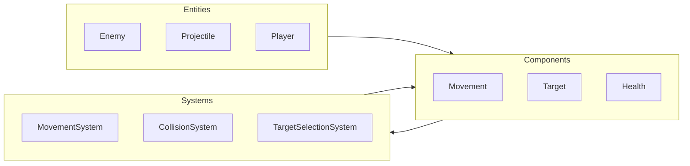

# Правила оптимизации ECS (Vampire Survivors)

## Enforcement

При написании или изменении кода геймплея, физики, движения, врагов или снарядов **обязательно** проверяй соответствие этому документу.

**Чеклист перед финализацией кода:**

- [ ] Тяжёлые системы используют Burst и Jobs.
- [ ] Нет `MonoBehaviour.Update()` для массовых объектов.
- [ ] Чёткое разделение: ECS — логика/физика, GameObjects — визуал/анимации.
- [ ] UI и звук получают данные только через EntityCommandBuffer/событийные сущности.

---

## Архитектурный стиль

- **ECS** используется для:
  - перемещения (враги, снаряды, игрок);
  - коллизий (враг–игрок, снаряд–враг, пикапы);
  - поиска целей (аггрейшн, таргетинг оружия)
  для **тысяч** сущностей.
- Все массовые объекты — **Entity** + компоненты; системы — `ISystem` / `SystemBase` с запросами по компонентам.
- В горячем коде не используются GameObjects.

---

## Гибридный подход

| Зона | Технология | Детали |
|------|------------|--------|
| **Логика, физика** | ECS | Движение, здоровье, урон, спавн, таргетинг. Только `IComponentData` / `ISharedComponentData` и системы. |
| **Визуал, анимации** | GameObjects / Authoring | Спрайты, меши, префабы. **Baking** (Baker) преобразует Authoring → Entity + компоненты. Визуал синхронизируется из систем через `LocalTransform` или связь с рендером (LinkedEntityGroup, инстансинг). |

**Запрещено:**

- Переносить логику движения или коллизий в MonoBehaviour.
- Держать тысячи объектов в иерархии с отдельными MonoBehaviour.

---

## Производительность

**Обязательно:**

- **Burst Compiler** (`[BurstCompile]`) и **C# Job System** (`IJobEntity`, `Entities.ForEach` с `Schedule` / `ScheduleParallel`) для всех систем, обрабатывающих движение, коллизии, поиск целей и урон.

**Запрещено:**

- `MonoBehaviour.Update()`, `FixedUpdate()` или любой per-object код на MonoBehaviour для врагов, снарядов, пул-объектов (массовые объекты).
- Исключение: единичные менеджеры (UI, аудио), которые только **получают** события от ECS.

**Рекомендации:**

- Нативные структуры в компонентах; минимум ссылок на managed-объекты в hot path.
- При необходимости — `NativeArray` / `NativeList` в jobs.

---

## Управление данными

- **IComponentData:** все изменяемые и индивидуальные свойства сущности (позиция, скорость, здоровье, цель, тип снаряда, таймеры). Структуры, blittable где возможно.
- **ISharedComponentData:** общие ресурсы/настройки (архетип врага, префаб визуала, настройки оружия) для группировки сущностей в архетипы и уменьшения раздувания чанков.
- В компонентах, используемых в Jobs, **не хранить** ссылки на MonoBehaviour или тяжёлые managed-объекты.

---

## Взаимодействие ECS с UI и звуком (MonoBehaviour)

- UI и звук остаются на **MonoBehaviour** (или высокоуровневых менеджерах). Системы ECS **не вызывают** их напрямую.
- **Канал связи:** **EntityCommandBuffer (ECB)**. При наступлении события (урон игроку, убийство врага, подбор предмета, смена оружия) системы добавляют в ECB команды или создают **событийные сущности** с компонентом-маркером (например, `PlayerDamagedEvent`, `EnemyKilledEvent`).
- Отдельная система или MonoBehaviour, выполняющийся **после** ECS (или в конце фрейма), читает ECB/событийные сущности и вызывает UI/звук. После обработки — удаление событийных сущностей или очистка буфера.
- **Контракт:** один явный набор событий и компонентов с данными для UI/звука; не размазывать вызовы UI/Audio по разным системам.

---

## Примеры

**Плохо:** враг — `MonoBehaviour`, в `Update()` — движение и проверка дистанции до игрока.

**Хорошо:** враг — Entity с `Movement`, `Target`, `EnemyTag`; `MovementSystem` и `TargetSelectionSystem` с `[BurstCompile]` и `IJobEntity`; визуал — отдельный префаб, запечённый и привязанный к Entity.

---

**Плохо:** система урона напрямую вызывает `UIManager.ShowDamage()` или `AudioSource.PlayClipAtPoint()`.

**Хорошо:** система добавляет в ECB компонент `PlayerDamagedEvent { float Amount; }` на игрока или синглтон-сущность; система/MonoBehaviour «ApplyEvents» обрабатывает события и вызывает UI/звук.

---

## Итоговый чеклист проверки

- [ ] Массовые объекты — только Entity, без `MonoBehaviour.Update`.
- [ ] Тяжёлые системы — с Burst и Jobs (`IJobEntity` / `Schedule`).
- [ ] Данные: `IComponentData` / `ISharedComponentData` по правилам выше.
- [ ] Визуал/анимации — через Baking и гибрид, не логика в MonoBehaviour.
- [ ] UI/звук — только через ECB/событийные сущности, без прямых вызовов из ECS.
